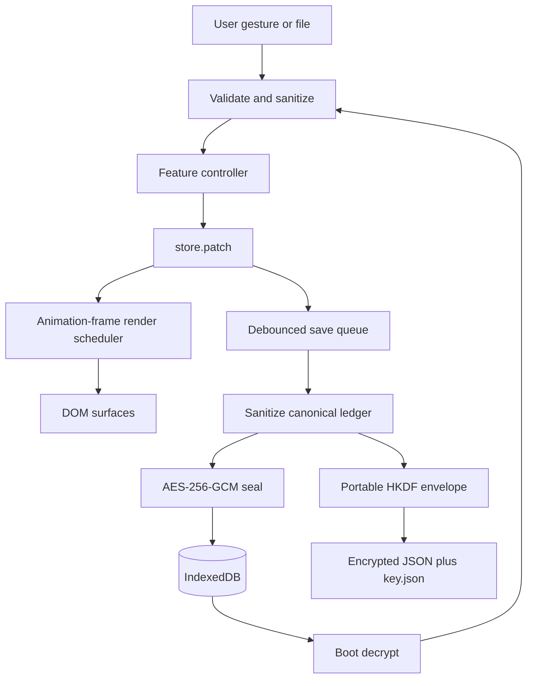

# OpenExpense Teacher's Guide

Audience: instructors teaching secure frontend engineering, applied financial
mathematics, browser cryptography, and maintainable open-source systems.

Companion audit:
[`SECURITY-MATHEMATICS-AUDIT-2026-08-19.md`](SECURITY-MATHEMATICS-AUDIT-2026-08-19.md).
Data specification: [`DATA-FORMAT.md`](DATA-FORMAT.md). Contributor naming and
DOM contract: [`CODEMAP.md`](CODEMAP.md).
For a shorter, lesson-by-lesson entry route, begin with
[`LEARNING-PATH.md`](LEARNING-PATH.md).

## SECTION 1: ARCHITECTURAL OVERVIEW

### 1.1 What the system is

OpenExpense is a static, local-first single-page application. The browser is
the application server, database client, cryptographic boundary, rendering
engine, and file client. There is no account service or ledger API.

The authored source is deliberately layered:

| Layer | Responsibility | Must not do |
| --- | --- | --- |
| `index.html` | Semantic shell, CSP, accessibility landmarks, boot fallback | Compute ledger totals |
| `openexpense.css` | Tokens, responsive frames, component layout | Encode application state |
| `src/main.js` | Bootstrap, delegated actions, render scheduling | Reimplement feature math |
| `src/core/` | Pure math, validation, crypto, files, state | Depend on page layout |
| `src/features/` | Calendar, editor, search, receipt, reports | Bypass store/persistence contracts |
| `src/ui/` | Reusable controls and visualizations | Own ledger business rules |
| `src/engine/` | Headless/embed API | Change public host exports casually |
| `scripts/qc-*.mjs` | Executable specifications | Depend on a browser backend |

`app.js`, `engine.js`, and `chunk-*.js` are reproducible build products. They
are committed because GitHub Pages does not run a build step.

### 1.2 Data-flow map



Teaching prompt: ask learners why validation appears both before decryption
and after plaintext recovery. The answer is that cryptographic authenticity
proves who held the key and that bytes were unchanged; it does not prove that
the recovered object is safe or semantically valid.

### 1.3 Boot sequence

1. `index.html` stamps `data-frame` early to avoid a responsive-layout flash.
2. `src/main.js` reads non-sensitive preferences.
3. IndexedDB opens and the local record is decrypted.
4. `sanitizeLedger` reconstructs an allowlisted ledger.
5. `patch` publishes state.
6. The render scheduler coalesces changes into one animation frame.
7. Persistence subscribes to later ledger changes.
8. Document-level delegation routes frozen `data-action`, `data-view`, and
   `data-tab` hooks.

### 1.4 Security architecture

Assets protected:

- transaction titles, amounts, dates, notes, categories, and groups;
- planner and budget rules;
- portable master secrets and the device-bound key;
- integrity of backup pairs and linked-folder writes;
- UI availability under hostile imported files.

Principal threats:

- DOM XSS from typed, imported, or OCR-derived strings;
- malformed JSON/ZIP/PDF/image resource exhaustion;
- ciphertext, header, or key substitution;
- weak or attacker-selected key-derivation parameters;
- out-of-order autosaves and partial two-file updates;
- prototype-pollution keys;
- browser-profile or same-origin compromise.

Primary controls:

- allowlist reconstruction with size and count caps;
- escaping or text-node assignment at DOM boundaries;
- same-origin CSP and no-referrer policy;
- integer-cent arithmetic;
- AES-256-GCM with authenticated headers and random 96-bit IVs;
- HKDF-separated encryption/commitment material;
- bounded PBKDF2 work factors;
- serialized persistence and action locks;
- recovery-pair staging for linked folders.

The design does not claim to defeat a compromised browser profile. A
non-extractable key cannot be exported, but malicious same-origin code can ask
the browser to use it.

## SECTION 2: MATHEMATICAL FOUNDATIONS

### 2.1 Integer-cent model

The foundational conversion is

\[
\operatorname{toCents}(a)=\operatorname{round}(100a),\qquad
\operatorname{fromCents}(c)=c/100.
\]

JavaScript equivalent:

```js
const cents = Math.round(Number(amount) * 100);
const amount = cents / 100;
```

Every sum should remain in cents. This turns the classic
`0.1 + 0.2 !== 0.3` problem into the exact integer sum \(10+20=30\).

An important proof obligation is safe integer range. The current maximum is

\[
25{,}000 \times \$1{,}000{,}000{,}000 \times 100
=2.5\times10^{15}\text{ cents},
\]

which is below \(2^{53}-1\), JavaScript's largest exactly represented integer.
Increasing either import limit requires rechecking this inequality.

### 2.2 Planner waterfall

Definitions:

- \(I\): income selected by the deposited/scheduled rule;
- \(S\): spending selected by the paid/logged rule;
- \(p_t\): tax percentage;
- \(p_s\): savings percentage;
- \(W\): weekly savings target;
- \(D_m\): days in the viewed month;
- \(H_f\): fixed monthly savings hold.

\[
\begin{aligned}
T &= \operatorname{cent}(I p_t/100),\\
A &= I-T,\\
R_w &= \operatorname{cent}(W D_m/7),\\
H &= [\text{reserve enabled}]R_w + H_f
     + \operatorname{cent}(A p_s/100),\\
P &= A-H,\\
L &= P-S.
\end{aligned}
\]

Refactored implementation:

```js
const taxWithheld = percentOf(countedIncome, rules.taxWithholdPct);
const afterTaxIncome = subtractMoney(countedIncome, taxWithheld);
const weeklyMonthReserve = monthReserve(rules.weeklySavings, currentDate);
const percentageHold = percentOf(afterTaxIncome, rules.savingsPct);
const savingsHold = addMoney(
  reserveEnabled ? weeklyMonthReserve : 0,
  rules.savingsFixed,
  percentageHold
);
const spendableIncome = subtractMoney(afterTaxIncome, savingsHold);
const potentialSavings = subtractMoney(spendableIncome, countedSpend);
```

The source keeps a few shorter private identifiers for established functions,
but public concepts and returned fields use the domain terms above. The
50/30/20 values are comparison caps against after-tax income; subtracting them
again would double-count savings.

### 2.3 Remaining days and safe spend

\[
D_{\mathrm{left}}=
\begin{cases}
D_m & \text{future month},\\
D_m-d+1 & \text{current month},\\
0 & \text{past month}.
\end{cases}
\]

\[
\text{dailySafe}=
\begin{cases}
\operatorname{cent}(L/D_{\mathrm{left}}),&D_{\mathrm{left}}>0,\\
0,&\text{otherwise}.
\end{cases}
\]

```js
if (remainingDayCount <= 0) return 0;
return Utils.fromCents(
  Math.round(Utils.toCents(potentialSavings) / remainingDayCount)
);
```

Today is included because its spending opportunity has not fully elapsed.
Returning zero for a closed month prevents division by zero and avoids
inventing future spending capacity.

### 2.4 Burn rate and runway

\[
\text{dailyBurn}=\operatorname{cent}
\left(\frac{S}{\max(1,D_{\mathrm{elapsed}})}\right),
\qquad
\text{runway}=
\begin{cases}
\operatorname{round}_{0.1}(C/\text{dailyBurn}),&\text{dailyBurn}>0,\\
\text{null},&\text{otherwise}.
\end{cases}
\]

`null` means runway is undefined because there is no burn, while zero means a
known amount of no capacity. This distinction should survive presentation.

### 2.5 Snapshot identities

\[
\begin{aligned}
\text{monthNet}&=\text{scheduledIncome}-\text{loggedSpend},\\
\text{currentFunds}&=\text{settledIncome}_{\le t}
                     -\text{settledSpend}_{\le t},\\
\text{savingsFunds}&=\text{settled net before month start},\\
\text{savingsAfterMonth}&=\text{savingsFunds}+L.
\end{aligned}
\]

Pending income is useful for projection but is not cash in hand. Mixing those
two answers is a common finance-UI error and is intentionally avoided.

Growth and savings percentages:

\[
\text{growthPct}=100L/C_s,\qquad
\text{savingsRate}=100\,\text{monthNet}/\text{monthIncome}.
\]

Both formulas guard a zero denominator. Growth is `null` unless current
savings \(C_s>0\).

### 2.6 Settlement, averages, and change

\[
\text{paidPct}=100\frac{\text{paid}}{\text{total}},
\qquad
\Delta=100\frac{\text{current}-\text{previous}}{\text{previous}}.
\]

An empty total yields 0% settlement. Positive current value after a zero
previous period yields an undefined change rather than a misleading infinity.

All monetary averages now use:

```js
function averageMoney(total, divisor) {
  const count = Number(divisor);
  if (!Number.isFinite(count) || count <= 0) return 0;
  return Utils.fromCents(Math.round(Utils.toCents(total) / count));
}
```

The function rounds once, at the financial boundary.

### 2.7 Weekly target allocation

For row \(r\) containing \(d_r\) in-month days:

\[
P_r=\operatorname{round}\left(P\frac{d_r}{D_m}\right).
\]

The last row receives \(P-\sum_{r<last}P_r\), proving that all row targets sum
to exactly \(P\) despite intermediate rounding.

The alert rule is not based on aggregate weekly overspend. It counts days
where spend is positive and greater than daily safe:

- 0–1 such days: no rail;
- 2: half warning;
- 3 or more: full warning.

### 2.8 Recurrence

Weekly:

\[
t_i=t_0+7i\text{ UTC days}.
\]

Monthly, bimonthly, and quarterly:

\[
m_i=m_0+si,\qquad
d_i=\min(d_0,\operatorname{daysInMonth}(m_i)),\quad s\in\{1,2,3\}.
\]

UTC arithmetic avoids daylight-saving shifts. Destination-day clamping gives
February 28/29 for a January 31 series. Seed counts are 52 weekly copies or
\(\max(1,\lfloor12/s\rfloor)\) monthly-step copies.

Schedule identity is not a mathematical similarity test. New occurrences share
a random 128-bit `seriesId`; update and delete compare that stable identity.
Legacy rows without an ID temporarily use normalized title, kind, and cadence
until an edit migrates the whole schedule. This prevents two equal-looking
weekly payments from becoming one destructive equivalence class.

### 2.9 Visualization geometry

Dial circumference and fill:

\[
c=2\pi r,\qquad \text{dash}=c\cdot
\operatorname{clamp}(\rho,0,1).
\]

Spark vertical coordinate:

\[
y=p_t+h-\frac{v-v_{\min}}
{\max(v_{\max}-v_{\min},1)}h.
\]

The denominator floor keeps a flat series finite. Bar and ring ratios are
clamped before becoming CSS/SVG geometry.

### 2.10 Priority savings-goal allocation

Goals form an ordered waterfall. For target \(i\), existing savings are assigned
first and removed from the pool:

\[
C_i=\min(S_i,T_i),\qquad S_{i+1}=S_i-C_i,\qquad
R_i=\max(0,T_i-C_i).
\]

With \(D_i=\max(1,\text{inclusive days remaining})\) and \(N\) the number of
days in the observation month, the required pace is:

\[
q_i=\frac{R_i}{D_i},\qquad
m_i=\left\lceil R_i\cdot\min\!\left(1,\frac{N}{D_i}\right)\right\rceil.
\]

Week and year holds use the same cap with 7 and the calendar-year length.
\(m_i\) never exceeds \(R_i\) after upcoming pay through the goal date is
applied. A $250 end-of-month goal covered by $961 in scheduled checks needs
a $0 hold. Monthly surplus is then assigned in priority order:

\[
A_i=\min(M_i,m_i),\qquad M_{i+1}=M_i-A_i.
\]

Projection uses \(A_i\) when the deadline is still in this month, or
\(A_i\cdot D_i/N\) when the deadline is later.

Because both pools shrink after each assignment, one dollar cannot fund two
goals. Goals without a target amount remain valid planning notes but consume no
money. Production arithmetic converts money to cents before allocation; see
`core/goals.js` and the executable cases in `scripts/qc-goals.mjs`.

Teaching prompt: reverse two goals with the same deadline but different target
amounts. Explain why total available money is unchanged while each goal's
feasibility state may change.

### 2.11 Cryptographic constants are mathematics too

| Constant | Value | Rationale |
| --- | ---: | --- |
| AES key | 256 bits | Application security level |
| GCM IV | 96 bits | Standard efficient GCM nonce size |
| GCM tag | 128 bits | Full authentication tag |
| HKDF salt | 256 bits | Fresh derivation context |
| Master secret | 256 bits | Input key material |
| Commitment | 256 bits | Independent derived key check |
| PBKDF2 export | 600,000 iterations | Current writer policy |
| PBKDF2 accepted | 210,000–1,200,000 | Reject weak and availability-hostile files |

## SECTION 3: FRONTEND & DOM LAYOUT MECHANICS (HTML/CSS)

### 3.1 Semantic hierarchy

`index.html` contains:

- one header with brand, privacy/file status, Undo, source, autosave, and theme;
- `#view-app` for Overview, Tracker, and Planner;
- `#view-docs` for Privacy and help;
- a shared `.ledger-stage` containing toolbar, calendar, and monthly register;
- a four-item bottom navigation;
- one welcome dialog and one reusable day-editor dialog;
- hidden file inputs for ledgers, keys, receipts, and PDFs;
- a no-script explanation.

The shared ledger stage is deliberately not a shell pane. `data-shell` selects
the major tab; CSS then decides which parts of the shared board are visible.

### 3.2 Frozen DOM vocabulary

IDs, class prefixes, and `data-*` actions form a cross-file interface. They are
not "unclear variables" available for cosmetic renaming. For example,
`#cal-col`, `.cal-day`, and `[data-action]` are consumed by source, CSS, tests,
and editor documentation.

Teaching point: clarity includes preserving stable contracts. Renaming a
private `d` to `dayOfMonth` improves local comprehension; renaming a public DOM
hook without migration damages system comprehension.

### 3.3 Responsive mechanics

The root element carries:

- `data-frame="phone|tablet|desktop"`;
- `data-shell="overview|tracker|planner|privacy"`.

An early inline script stamps the frame before first paint. `ui/frame.js`
maintains it after load. Calendar density additionally observes its own width,
because a component can be narrow even on a wide viewport.

CSS uses design tokens for both Professional and Black Card themes. Component
prefixes (`cal-`, `summary-`, `planner-`, `docs-`, and others) communicate
ownership and prevent selectors from becoming accidental global APIs.

### 3.4 State-to-DOM synchronization

1. A feature calls `patch({ changedField })`.
2. Subscribers receive the partial keys.
3. `main.js` combines multiple patches into one animation frame.
4. `app/render.js` checks `RENDER_DEPS`.
5. Only surfaces reading those fields repaint.

This is a small dependency graph rather than a virtual DOM. A new state field
must be added to every surface dependency set that reads it.

### 3.5 Event handling

Stable shell actions use document-level delegation. Feature-rich interactions
such as drag-to-day, modal editing, and chart selection bind local listeners.
Keyboard equivalents are present for day cells, search rows, dialogs, and
reordering.

Pointer drag uses a movement threshold before capture. That keeps an ordinary
tap from becoming a drag. Listeners are removed on pointer up/cancel, and visual
drop state is cleared on every exit path.

### 3.6 Safe DOM construction

Preferred order:

1. `textContent` for user text;
2. element construction and `setAttribute` for structure;
3. `innerHTML` only for reviewed static templates or explicitly escaped
   interpolations.

`Utils.escapeHtml` encodes `& < > " '`. It is an HTML-text encoder, not a URL,
CSS, JavaScript, or attribute-policy validator. Use it only in the context for
which it was designed.

## SECTION 4: CORE APPLICATION LOGIC & STATE (JavaScript)

### 4.1 State model

| Field | Meaning |
| --- | --- |
| `events` | Date-keyed arrays containing expense and income entries |
| `budgets` | Positive monthly category caps |
| `plan` | Count basis, withholds, holds, ratios, and weekly reserves |
| `goals` | Ordered savings targets and allocation priority |
| `ledgerName` | Display/export name |
| `currentDate` | Viewed month |
| `selectedKey` | Open day or `null` |
| `editingIndex` | Edited row or `null` |
| `ledgerFace` | Expense or income register |
| `trackerFilter` | All, expense, or income calendar filter |
| `shellTab` | Overview, Tracker, Planner, or Privacy |
| `isDark` | Visual theme |
| `autosaveEnabled` | Whether ledger patches persist |
| `storageEncrypted` | Whether secure browser crypto is available |

`ledgerFace` and `trackerFilter` are intentionally separate. "Show all on the
calendar while keeping the income register open" requires both.

### 4.2 Entry lifecycle

1. The day editor reads a date and optional row index.
2. Form input is normalized: title, price, kind, status, recurrence, category,
   group, and note.
3. Twin/series logic determines whether a confirmation is needed.
4. A new events object is produced.
5. `patch` updates the store.
6. Calendar, snapshot, register, and persistence react to the same change.
7. Delete snapshots remain in memory briefly for Undo.

### 4.3 Import lifecycle

1. File size is checked before text or ZIP expansion.
2. JSON is parsed and classified as encrypted ledger, key, or plaintext.
3. Envelope and key dimensions/algorithms/work factors are validated.
4. Matching key IDs are required.
5. The payload is decrypted.
6. `sanitizeLedger` builds a fresh allowlisted object with bounded counts.
7. Plaintext import requires explicit confirmation.
8. Portable key references are wiped best-effort.

### 4.4 Persistence lifecycle

Autosave listens only to ledger-bearing fields: `{ name, events, budgets, plan,
goals }`. A 400 ms debounce batches rapid edits. `saveQueue` serializes
encryption and commits:

```js
const nextSave = saveQueue
  .catch(() => {})
  .then(() => commitLedger(canonicalLedger));
saveQueue = nextSave;
```

This sequence prevents an earlier, slower encryption from overwriting a later
edit. Encryption failure is fail-closed; no new plaintext record is written.

### 4.5 Search and classification

Search tokenizes free text, category/group keys, `is:` predicates, date keys,
and amount bounds. Labels are normalized but not executed as regular
expressions or code.

Category suggestion is deterministic and local. Ordered regular expressions
map merchant text to a built-in category; explicit user choice and remembered
history outrank the guess. OCR and category classification never bypass user
confirmation.

### 4.6 Rendering modules

- `calendar.js`: month geometry, day net, grouped pills, week rails with a
  rotated week net, drag move;
- `dash-strip.js`: Overview snapshot and Planner controls;
- `goals.js`: goal editor, priority reorder, feasibility display, hold action;
- `sidebar.js`: month summaries, categories, groups, budgets, entries, PDF;
- `modal.js`: day editing, recurrence, group operations;
- `search-panel.js`: query UI and CSV handoff;
- `receipt-picker.js`: synchronous native chooser and date context;
- `receipt.js` / `receipt-parse.js`: lazy bounded local extraction and suggestions.

The calculations live in `core/summary.js`, `core/plan.js`, and
`core/goals.js`, so UI surfaces cannot quietly disagree about totals.

## SECTION 5: SECURITY POSTURE & HARDENING

### 5.1 Findings corrected in this educational pass

#### Availability: unbounded PBKDF2 iterations

Before, validation enforced only a minimum. A hostile key file could request a
huge work factor. Authentication does not help because the CPU cost is paid
before authentication can fail.

Now both `validateKeyFile` and `unwrapSecret` enforce:

```js
MIN_WRAP_ITERATIONS <= iterations
  && iterations <= MAX_WRAP_ITERATIONS
```

#### Boundary defense for direct crypto APIs

The app-level import path validated byte lengths, but reusable envelope
functions did not. They now reject malformed salt, IV, commitment, ciphertext,
and wrapped-secret dimensions before expensive Web Crypto work.

#### Impossible OCR dates

Checking only `1 <= day <= 31` accepts February 31. The parser now constructs a
UTC candidate and verifies that year, month, and day round-trip unchanged.

#### Monetary average precision

Monetary averages now divide integer cents and round once. Year aggregation
also rejects month indexes outside 0–11 even when called outside the sanitized
browser import path.

#### Decimal half-cents and schedule identity

Decimal-to-cent conversion parses digits rather than multiplying a binary
float, so `1.005` becomes 101 cents deterministically. Recurring schedules now
use `seriesId`, preventing unrelated equal-title schedules from being merged,
updated, or deleted together.

#### Planner and interval boundaries

Negative spendable income allocates a zero weekly budget rather than negative
row targets. “Next 7 days” is the inclusive seven-date interval from today
through day six. Negative imported prices are rejected because transaction
direction belongs to `kind`.

### 5.2 Existing defenses verified

- No ledger network endpoint, analytics collector, or embedded secret.
- Imported fields are reconstructed, bounded, and prototype keys blocked.
- Dynamic ledger labels are escaped or inserted as text.
- Boot errors use `textContent`.
- ZIP expansion has compressed, per-entry, count, and total-expanded caps.
- Receipt/PDF workloads have explicit resource limits.
- Device keys are non-extractable and atomically initialized.
- AES-GCM IVs are fresh and headers authenticated.
- Portable v2 encryption uses HKDF domain separation and key commitment.
- Autosaves are ordered and clear is transactionally durable.
- Linked-folder updates stage a complete recovery pair.

### 5.3 Residual risks

| Risk | Why it remains | Teaching mitigation |
| --- | --- | --- |
| Compromised origin/browser | Origin code can invoke a non-extractable key | Secure dependencies, headers, browser profile |
| Multi-tab business conflict | Serialization does not merge edits | Edit in one tab; add revisions for supported collaboration |
| Two-file download atomicity | Browser downloads are not a transaction | Clear custody warning; linked-folder recovery staging |
| Inline-script CSP allowance | Boot/frame scripts and JSON-LD are inline | Externalize executable bootstrap or use hashes |
| JavaScript memory erasure | Garbage collection is outside app control | Minimize lifetime and references; do not promise secure wipe |
| OCR misclassification | Heuristic extraction is probabilistic | Require review before save |

### 5.4 Student security review checklist

- Trace every value reaching `innerHTML` back to its source and encoder.
- Check limits before allocation, parse, decompression, KDF, and rendering.
- Require exact byte dimensions for cryptographic material.
- Authenticate metadata as well as ciphertext.
- Distinguish confidentiality from same-origin runtime compromise.
- Model races at the operation level, not merely the final database call.
- Test both denominator zero and negative-domain behavior.
- Treat date constructors as normalizers, not validators.

## SECTION 6: REFACTORED CODE SPECIMENS

### 6.1 Canonical production files

The complete hardened specimens are the repository files themselves:

| Requested specimen | Canonical production file |
| --- | --- |
| `index.html` | [`../index.html`](../index.html) |
| `styles.css` | [`../openexpense.css`](../openexpense.css) |
| `app.js` | Generated [`../app.js`](../app.js); authored entry is [`../src/main.js`](../src/main.js) |

The stylesheet retains the established name `openexpense.css`; adding a second
`styles.css` copy would create drift. The generated bundle is not annotated by
hand because comments and names would be discarded on the next build. The
complete annotated application source is:

- [`../src/app/`](../src/app/)
- [`../src/core/`](../src/core/)
- [`../src/features/`](../src/features/)
- [`../src/ui/`](../src/ui/)
- [`../src/engine/`](../src/engine/)

This is a production-accuracy rule, not an omission: presenting a simplified
single `app.js` as the application would hide the actual crypto, import,
planner, and rendering boundaries learners are meant to study.

### 6.2 HTML specimen: safe boot error text

```js
const errorDescription = bootError.querySelector('#boot-error-desc');
errorDescription.textContent = String(
  message || window.__oeBoot.err || 'The app script failed to load.'
);
```

Why: browser error strings can contain resource URLs or third-party exception
text. `textContent` guarantees that none becomes markup.

### 6.3 CSS specimen: state belongs on the root

```css
html[data-shell="planner"] .ledger-stage {
  display: none;
}
```

Why: a single shell attribute is easier to audit than independently toggling
many descendants and risking a stale sensitive view.

### 6.4 JavaScript specimen: validated calendar date

```js
function validIsoDate(yearInput, monthInput, dayInput) {
  let year = Number(yearInput);
  const month = Number(monthInput);
  const day = Number(dayInput);
  if (year < 100) year += year >= 70 ? 1900 : 2000;
  if (!Number.isInteger(year) || !Number.isInteger(month)
      || !Number.isInteger(day) || year < 2000 || year > 2100
      || month < 1 || month > 12 || day < 1) {
    return null;
  }
  const candidate = new Date(Date.UTC(year, month - 1, day));
  if (candidate.getUTCFullYear() !== year
      || candidate.getUTCMonth() !== month - 1
      || candidate.getUTCDate() !== day) {
    return null;
  }
  return `${year}-${Utils.pad(month)}-${Utils.pad(day)}`;
}
```

Why: `Date` silently normalizes invalid dates. Field round-tripping converts it
into a validator.

### 6.5 JavaScript specimen: bounded password work

```js
const iterations = Number(wrappedSecret.iterations);
if (!Number.isInteger(iterations)
    || iterations < ENVELOPE.MIN_WRAP_ITERATIONS) {
  throw new Error('ENVELOPE_WEAK_WRAP');
}
if (iterations > ENVELOPE.MAX_WRAP_ITERATIONS) {
  throw new Error('ENVELOPE_EXCESSIVE_WRAP');
}
```

Why: a security parameter can also be an availability input. A lower bound
prevents weak derivation; an upper bound prevents computational denial of
service.

### 6.6 JavaScript specimen: cent-safe average

```js
function averageMoney(total, divisor) {
  const count = Number(divisor);
  if (!Number.isFinite(count) || count <= 0) return 0;
  return Utils.fromCents(Math.round(Utils.toCents(total) / count));
}
```

Why: monetary division leaves the integer domain, so the code defines exactly
where rounding occurs.

### 6.7 Laboratory exercises

1. Add a test proving that three entries of `$0.10` sum to `$0.30`.
2. Mutate an authenticated envelope header and explain why decryption fails.
3. Design an optimistic revision field for multi-tab writes.
4. Replace one reviewed `innerHTML` template with DOM construction and compare
   readability and attack surface.
5. Prove that final-row remainder allocation preserves the monthly target.
6. Generate recurrence dates from January 31 for leap and non-leap years.
7. Explain why a meta CSP cannot enforce HSTS or `frame-ancestors`.

### 6.8 Verification commands

```bash
npm run build
npm test
npm audit --omit=dev
```

The build must run before tests because quality checks compare authored source
with committed production bundles.

